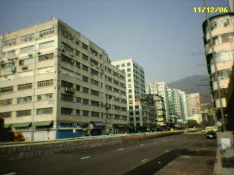

Singer(band): Groove Coverage  
Title: 7 Years and 50 Days  
Lyrics:  
7 Years and 50 Days, the time is passing by,  
nothing in this world could be,as nice as you and I.  
And how could we break, up like this,  
and how could we be wrong,so many years,so many days,  
and I still sing my song.  
  
Now I run to you,like I always do,  
when I close my eyes,and think of you,  
such a lonely girl,such a lonely world,  
when I close my eyes I dream,  
I return to you,like I always do,  
when I close my eyes and think of you,  
such a lonely girl,such a lonely world,  
when I close my eyes I dream,of you.  
  
7 years and 50 days,  
now just look at me,am I the girl,  
I used to be,so damn what do you see.  
  
And how could we break,up like this,  
and how could we be wrong,so many years,  
so many days,and I still sing my song.  
  
Now I run to you,like I always do,  
when I close my eyes and think of you,  
such a lonely girl,such a lonely world,  
when I close my eyes I dream,  
I return to you,like I always do,  
when I close my eyes and think of you,  
such a lonely girl,such a lonely world,  
when I close my eyes I dream,of you.  
  
7 Years and 50 Days, the time is passing by,  
nothing in this world could be,as nice as you and I.  
  
And how could we break, up like this,  
and how could we be wrong,  
so many years,so many days,and I still sing my song.  
  
Now I run to you,like I always do,  
when I close my eyesand think of you,  
such a lonely girl,such a lonely world,  
when I close my eyes I dream,I return to you,like I always do,  
when I close my eyes and think of you,  
such a lonely girl,such a lonely world,  
when I close my eyes I dream,of you.  

  
a lonely world...I am not in love...
