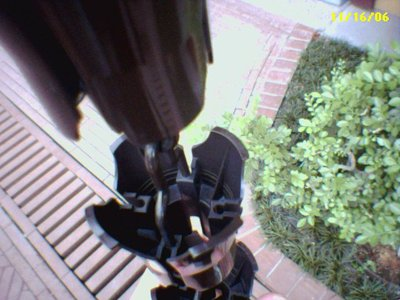
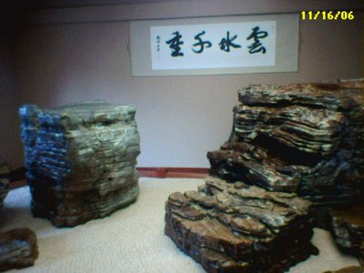

point form 極速日記始動...

今日出街唔記得帶wallet...殘念...  
\- 巴士...散銀夠  
\- Library...無證無入  
\- lunch...今日同ying, kayee, raymond 一齊去佐敦沙爹王...nice taste...阿ying 出"住"先...XD thanks  
\- 機舖...用埋淨番ge 四蚊...Raymond 出左兩個credits 比我玩XD thanks  
\- 最後一程地鐵...用埋最後一個銀仔買優惠單程飛  
所有洗費完成...

搭到番鑽石山總於去左南苑..  
的確好靚, 個公園細細地, 但有好多景, 影相人一定要去!!!

去完南苑去埋荷記配眼鏡...最新視力: 左/右: +1.25 (125度近視) 散光: 0  
眼鏡sunday pm 有得攞...我覺得幾好睇lol

  
南苑獨特ge National 引水管

  
"石館"入面其中一個景
