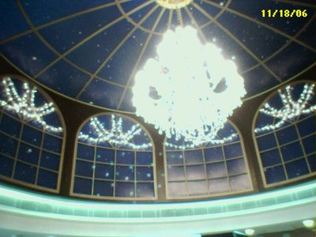
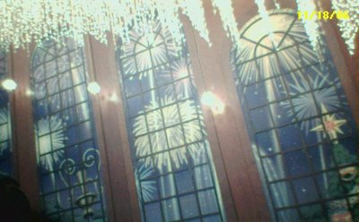
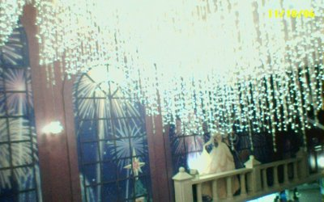
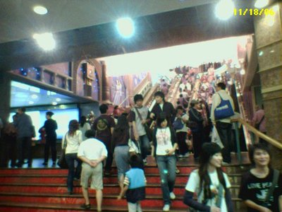

今日好tired ... 唔係肉體上 ...係精神上...

尋日明知今日要test AC 但都睇小說睇到零晨n點先訓... (n 唔記得幾多)  
搞到今朝起身都無乜精神, 但都要去test ga...  
較到好mun 先去到, 差d 遲到tim...  
不過其實遲都無所謂, 電腦卷我一向都卷到拿來, 個零鐘ge 卷可以做淨半個鐘..orz...個ar sir 仲話會arm arm 夠時間only...bs...;p  
(插曲: 因為無帶擦膠...中途lup 左旁邊個個人好多次擦膠...好彩佢肯比我lup...好多謝你ar...雖然我唔知你叫咩名 XD)  
但做完卷都係好攰ge...  
回家中途都係煲書...燒埋d 殘餘精神...

番到屋企極慢速咁食完個飯盒...有幸msn聯絡上好湯...  
開始我的一年大計...補習網...講左少少...有少少idea...但program tech.方便都係快d 落手好...  
唔係用靜態頁都係遲早要換...(xanga唔講咁多電腦野)  
但...煲書打機都係燒精神ge 話, 做咁大個programming route 真係唔知可以用d 咩黎形容佢ge 損耗速度  
係我當時的狀態10分鐘已經唔得...要上床回血, 係我今年第一次係床度訓午覺, 可知係攰到點..

訓到5點到先比人嗌醒...因為要進入下一場...  
食左少少野再去做數...再....去德褔vz 打機(幾蚊玩bm onli, 有精神玩bm 都好玩d)  
入到vz 有種好幸福的感覺  
ps. vz 個商場裝修得好靚丫!! 好有聖誕feel...下面po 相

唔講la...已經好長

result>>>>成日都係"燒"精神...相比以前考溫書個隻"磨"精神, 今日呢d 先叫爽!!!  
訓覺的日子的確好爽...<<<<長年唔夠訓的體會

  
天花

  
電梯邊

  
人山人海
