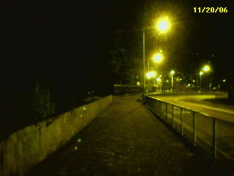

朝早一起身起經係一個註定遲到的時間....  
好悠閒咁"趕"到番去上econ 堂...

之後食左一個價值五十蚊ge 即食麵就去左library 做compu...  
原來kristy 都係去library 溫書ge...今日先知tim...睇黎以後大把機會睇到佢

之後向大家推介一個php 的源碼(唔知係咪會有人要),  
係我係library 做完CA assignment 個陣上網搵到ge...  
分別係J\_Space 同E\_Space...免費開源又有中文版ge 人才軟件同交友站軟件,  
功能上算幾強下ga, [http://www.wesofts.com/ajax/index.html](http://www.wesofts.com/ajax/index.html) 有興趣上去睇下...  
however, 我setup 左一次發覺用唔著

今日放學果陣搭5C 又訓著左...  
好彩最後一個站(慈正村仲要上, 但唔係總站)果陣有人拍醒左我(註:係個漂亮女生XD)...  
唔係比人車左唔知去邊咯...

今日actually 好無聊...但因為搭過站, 行番好耐無行ge 路, 有種好特別的感覺...

  
今日番屋企的落山路
