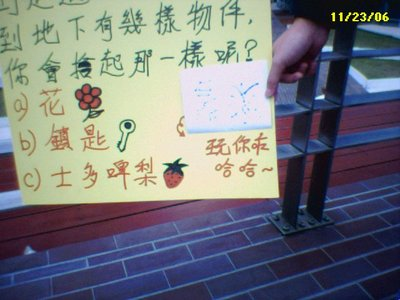

| Priority | Course | Institution |
| --- | :-- | :-- |
| 1 | 1169 BBA (Hons) Electronic Commerce  | [City University of H K](http://www.cityu.edu.hk/admo/) |
| 2 | 3703 BEng (Hons) in Electronic & Information Engineering  | [The H K Polytechnic University](http://www.polyu.edu.hk/) |
| 3 | 6999 BEng in Mechanical Engineering / BEng in Mechanical Engineering (Building Services Engineering)  | [The University of Hong Kong](http://www.hku.hk/admission/ug.htm) |
| 4 | 5426 BEng Computer Science (Information Engineering)  | [The Hong Kong University of Science and Technology](http://www.ab.ust.hk/arr) |
| 5 | 1121 BBA (Hons) Financial Engineering  | [City University of H K](http://www.cityu.edu.hk/admo/) |
| 6 | 5816 BBA Information Systems  | [The Hong Kong University of Science and Technology](http://www.ab.ust.hk/arr) |
| 7 | 3519 BSc (Hons) in Internet & Multimedia Technologies  | [The H K Polytechnic University](http://www.polyu.edu.hk/) |
| 8 | 5464 BEng Computer Engineering  | [The Hong Kong University of Science and Technology](http://www.ab.ust.hk/arr) |
| 9 | 1585 BEng (Hons) Electronic and Communication Engineering  | [City University of H K](http://www.cityu.edu.hk/admo/) |
| 10 | 2266 BBA (Hons) Information Systems Management  | [Hong Kong Baptist University](http://www.hkbu.edu.hk/~ar/admissions/jupas.htm) |
| 11 | 1092 BBA (Hons) Information Systems  | [City University of H K](http://www.cityu.edu.hk/admo/) |
| 12 | 3698 BEng (Hons) in Industrial & Systems Engineering  | [The H K Polytechnic University](http://www.polyu.edu.hk/) |
| 13 | 1614 BEng (Hons) Mechatronic Engineering  | [City University of H K](http://www.cityu.edu.hk/admo/) |
| 14 | 5529 BEng Electronic Engineering (Information and Communication Engineering)  | [The Hong Kong University of Science and Technology](http://www.ab.ust.hk/arr) |
| 15 | 3600 BSc (Hons) in Biomedical Engineering  | [The H K Polytechnic University](http://www.polyu.edu.hk/) |
| 16 | 3428 BEng (Hons) Scheme in Integrated Product Development  | [The H K Polytechnic University](http://www.polyu.edu.hk/) |
| 17 | 2448 BSc (Hons) Computing Studies (Information Systems)  | [Hong Kong Baptist University](http://www.hkbu.edu.hk/~ar/admissions/jupas.htm) |
| 18 | 1755 BEng (Hons) Electronic and Communication Engineering (Business Intelligence Minor)  | [City University of H K](http://www.cityu.edu.hk/admo/) |
| 19 | 6793 Bachelor of Business Administration (Information Systems)  | [The University of Hong Kong](http://www.hku.hk/admission/ug.htm) |
| 20 | 1250 BA (Hons) English for Professional Communication  | [City University of H K](http://www.cityu.edu.hk/admo/) |
| 21 | 2474 BSc (Hons) Physics - Physics with Computer Science  | [Hong Kong Baptist University](http://www.hkbu.edu.hk/~ar/admissions/jupas.htm) |
| 22 | 1597 BEng (Hons) Information Engineering  | [City University of H K](http://www.cityu.edu.hk/admo/) |
| 23 | 1157 BBA (Hons) Accountancy and Management Information Systems  | [City University of H K](http://www.cityu.edu.hk/admo/) |
| 24 | 6987 Bachelor of Engineering in Computer Science  | [The University of Hong Kong](http://www.hku.hk/admission/ug.htm) |
| 25 | 3569 BA (Hons) in Design  | [The H K Polytechnic University](http://www.polyu.edu.hk/) |

ngng....打夠廿五個la

