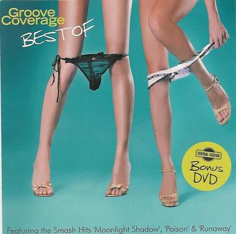
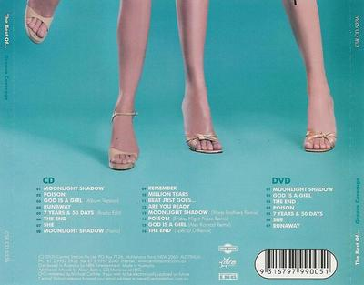

我和很多人都一樣... 都是聽了God is a Girl 而喜歡上Groove Coverage 的.

從那時開始, 我慢慢聽多了Groove Coverage 的歌了.

近來聽了她們95 年的選集...Best of 2005  
這張碟可以說是我有生以來最喜歡的專輯之一了...其他的有機會還說一下啊, 留個記憶.

這張碟的封面可能已經比示了她們對這專輯所期望的熱度了..  
下面貼上

專輯的歌質素高到唔似一隊咁高產量pop singer...

下面第一首開始

1 Moonlight Shadow  
聽呢首歌時無可避免我也想起了End of the Moonlight, 但當然表達的意義係唔同  
End of the Moonlight 是童話般的美好...Moonlight Shadow 就是剛剛的反面,  
看到他在絕望的戰斗中離去, 自己的感受是如何呢?  
呢首歌係好浪漫咁講左出黎,  
比一般的trance / newage, 旋律是簡單易記的  
比一般的trance, 你甚至也可以搵到一點不凡, 一點脫俗

2 Poison  
Groove Coverage 對旋律的配合水準高到將這首歌表現到一個令人自然投入去享受的高度  
有心留意歌詞的人, 也可以盡情的去享受這種幻想的激情

3 God Is A Girl (Album Version)  
這首曲可以說是無人不曉吧? 我也聽了無數次了, 包括各種版本, disco 中的熱播, 簡單整齊的節奏,  清楚的聲線, 簡單明白的字詞, 都也令這首歌成為其中一首傳世的經典.  
今次專輯收錄的Album Version 希望令聽過同無聽過的人都可以好好咁去了解呢首歌的意思  
更美妙的地方, 每次去聽呢首歌, 你可會諗到歌詞會表達唔同的意義  
...To those who a free, The mind shall be key...這可以說是一個信仰呢

4 Runaway  
這首是一首很精純的舞曲, 要表示自已的實力, 不用創新的旋律, 不用創新的歌詞, 不用獨特的結構,  
Groove Coverage 和一起的制作團隊也表現了不一樣, 以至超凡的張力,  
甚至這首歌有令人去珍惜, 短短的三分鐘中, 不希望它播完的吸引力...  
每個人都希望和她們一起唱"i'm singin Oh O O~"

5 7 Years & 50 Days (Radio Edit)  
一首很techno 的舞曲, 出手她們口中就將一個本身是高於水準的歌變得很突出.  
一個女孩, 在7年50日後, 和她的男友分手了,  
孤寂的女孩, 感到世界也是孤寂的, 為甚麼會這樣呢,  
會這首歌中, 她在不斷的回想...每一個想法也是容易上口的歌詞,  
當你跟著歌一直唱, 你也會開始慢慢的, 感到她的心情,  
一首如此輕快的disco 歌, 反而令人愈唱愈傷心.

6 The End  
每樣的事情都有終結, 情感, 人和人的關係, 也有嗎?  
在絕望的時望, 你也會想起某人嗎?  
這首歌叫the End, 但放在專輯的最後的話就會變俗了  
表示對人的愛, Groove Coverage可以十分直接的

7 She  
在六首有著無比的吸引力的歌之後,  
這首可說是讓大家的精神輕鬆一下, 雖然歌詞不那麼好唱,  
但輕搖滾的感覺, 不斷的去領導你去想那個"she",  
也令你好像在享受一個悠悠旅程

9 Remember  
如果你喜歡一個人甚麼記得他的所有說話,  
如果你開始感到無比的沉痛, 你會選擇去忘記嗎?

  
10 Million Tears  
這令我想起一公升眼淚了...這歌的歌詞很簡單的...  
I wanna know why I sing this song.   
I try to show how much I feel,  
但眼淚可以去衡量心傷嗎?  
Is it a lie or is it true?  
So many tears I've cried for you. 

隱型:

9.這首可以說是這專輯中最弱的一首了, 但我肯定放了出來其他人的專輯就一點也不弱的!  
旋律用了平常trance 中普遍用於回憶和夢境的8分電子亂音, 但刻劃不深刻

11 Beat Just Goes / 12 Are You Ready  
Groover Coverage 為這兩首techno 配音呢...  
基本上不是十分突出, 但這種音樂就是愈聽愈有味道的,  
可能Groove Coverage 想作新的嘗試和令多些人認識這種近年興起的純音樂吧

13 Moonlight Shadow (Warp Brothers Remix)  
14 Poison (Friday Night Possee Remix)  
15 God Is A Girl (Axel Konrad Remix)  
16 End (Special D Remix)  
13- 16技術上有興趣就去了解一下吧, 情感上沒甚麼好說的

8 Moonlight Shadow (Piano)  
(tech: 這首是第一首: Moonlight Shadow 的鋼琴版,  
但我所說的鋼琴只是一種一個小節只有兩個音的那種鋼琴版, 說清唱也不為過了  
這次可以令聽眾真正的去認識Groove Coverage 的唱功了.  
我覺得唱得很好...音準, 拍子準, 有空間感...平凡中現不平凡的  
絕對不會像某些歌手, 清唱時只會表演自己的音域, 氣量,  
唱到不跟譜曲, 有長音就鬥氣, 有高音就扯, 低音就壓, 對歌的表現力水平就不高了...)  
  
  
ps. 打了一個半小時的Xanga.... 但很滿足的
